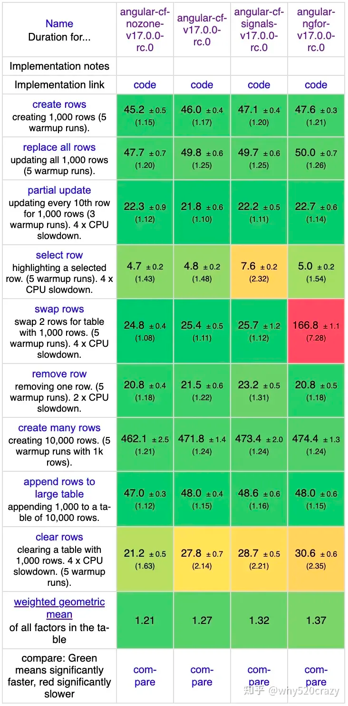

<!-- _class: lead -->

# Angular 最新更新

# AIGC 时代的前端　　　　

---

@include(about.md)

---

<!-- _class: section -->

# Angular 最新更新

Angular 17 最新更新

---

# 福利，一如既往

- 一键升级

  ```shell
  ng update @angular/cli @angular/core
  ```

  从 Angular 6 开始的**所有版本**都可以**一键升级**，直到 17

- 自动迁移到**新模板语法**

  ```shell
  ng g @angular/core:control-flow-migration
  ``` 

---

# 新文档

Beta 版：https://angular.dev

- **简化**的教程
  - 更适合**新手入门**
- **演练场** - Playground
  - 预置四个不同深度的**在线例子**
- **零环境**上手
  - 本地**不需要**搭建任何环境就能上手

---

# 新语法

- 新的**控制流**语法，如：

    ```
    @if (loggedIn) {
      The user is logged in
    } @else {
      The user is not logged in
    }
    ```

- 降低**学习成本**
- 提升**性能**、缩小**体积**

---

# 延迟加载页面

- 开箱即用，不需要特别做什么配置
- 任何一部分视图都可指定某种加载模式
  - **闲时**加载
  - **后台**自动加载
  - **定时延迟**加载
  - **进入视口**（viewport）时加载
  - 与特定元素有**交互**时加载
  - 鼠标**悬停**时加载

---

# 延迟加载页面语法概览

```
@defer (on viewport) {
  <comment-list/>
} @loading {
  Loading…
} @error {
  Loading failed :(
} @placeholder {
  
}
```

这里规定了延迟加载的**时机**（进入视口时）、**加载中**的界面、**出错时**的界面、**加载前**的占位符

---

# 性能提升



- 新语法下**性能**无短板
  - 新的编译机制
  - 新的目标码
- 新的**服务端渲染**和**预先渲染**
  - `ng add @angular/ssr`
- **CWV** 优化
  - 目标文件体积减小
  - 水合（hydration）

---

<!-- _class: section -->

# AIGC 与前端

---

# AIGC 带来的新机遇

- 表面影响
  - 代码**辅助生成**
  - 编程**知识问答**
- 深层影响
  - 新的**交互模式**
  - **低代码**平台的未来

---

# 新的交互模式

- 自然语言**会话**取代传统**导航**
  - 自然语言理解能力**白菜价**
  - 基于大模型，把**用户意图结构化**（DSL）
  - 以 DSL 作为**沟通媒介**
    - 用户世界（**自然语言**）与 程序员世界（**编程语言**）
- 多媒体输入输出方式
  - 自然语言中随意**嵌入多媒体**
  - 嵌入交互式图表等**广义多媒体**（自定义元素）

---

# 新的机遇

- 用户侧
  - **门槛更低**，有手就行
  - 更丰富的**表现力**，用户可自由选择视图模式
- 开发侧
  - 更高的**开发效率**（Copilot 等）
  - 更强的**复用性**（专注原子能力，让大模型编排）
  - 真正的**低代码**：解耦原子能力（**程序员**）与能力编排（**大模型**）

---

# 技术上的趋势

- **路由**将逐渐**弱化**
  - 把**自由**还给用户，别再教用户**怎么操作**，要教他如何**表达意图**
  - 一句话**直达**相应功能区
- 前端**程序**逐渐**碎片化**
  - 以组件为**基本发布单位**
  - 由大模型根据组件知识库**自动组装**出界面
- 从面向**实现**，转向面向**意图**
  - 阐明意图，让大模型**自动寻找**适当的实现

---

# 技术上的应对

- Custom Elements / Web Components
  - 让组件与框架**解耦**
  - 让文本中可以自由使用**广义多媒体**能力
  - Angular 6+ 提供了**开箱即用**的支持
- 面向意图编程
  - 程序员定义**模型**与**视图模型**，并通过名称和注释**描述意图**
  - 大模型根据**意图**生成代码
  - Angular 6+ 的**原理图**（Schematics）等

---

# 对程序员能力模型的影响

- **抽象能力**越来越重要
  - 做**减法**！试试把购物车抽象到极简会剩下什么？
- 正确**描述意图**成为基本功
  - 关注用户**要做什么**，而**不是怎么实现**
  - 关注**宏观步骤**和**联动逻辑**
- **大模型应用**成为必备技能
  - 了解主流大模型的**优缺点**
  - 掌握 **Prompt 技巧**

---

@include(contact.md)
